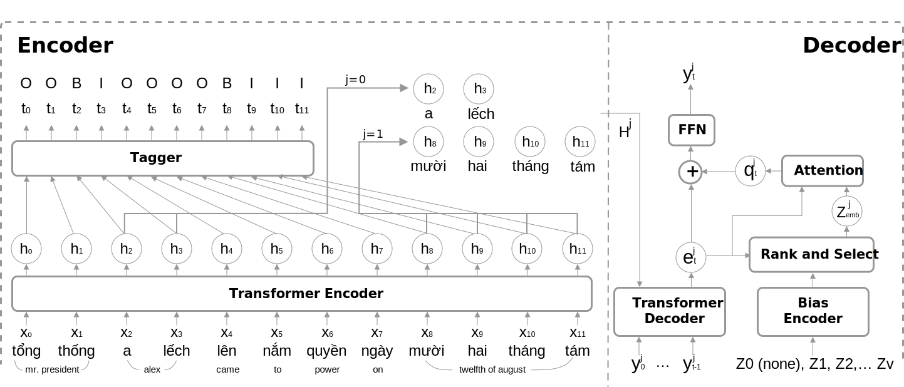

# Transformation spoken text to written text

This model is used for formatting raw asr text output from spoken text to written text (Eg. date, number, id, ...). It also supports formatting "out of vocab" by using external vocabulary. 

Some of examples:
```text
input  : tám giờ chín phút ngày mười tám tháng năm năm hai nghìn không trăm hai mươi hai
output : 8h9 18/5/2022

input  : mã số quy đê tê tê đê hai tám chéo hai không không ba
output : mã số qdttd28/2003

input  : thể tích tám mét khối trọng lượng năm mươi ki lô gam
output : thể tích 8 m3 trọng lượng 50 kg

input    : ngày hai tám tháng tư cô vít bùng phát ở sờ cốt lờn chiếm tám mươi phần trăm là biến chủng đen ta và bê ta
ex_vocab : ['scotland', 'covid', 'delta', 'beta']
output   : 28/4 covid bùng phát ở scotland chiếm 80 % là biến chủng delta và beta

```


## Model architecture


# Infer model

- Play around at [Huggingface Space](https://huggingface.co/spaces/nguyenvulebinh/spoken-norm-taggen)

## Contact 

nguyenvulebinh@gmail.com

[](https://twitter.com/intent/follow?screen_name=nguyenvulebinh)

